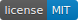

# imgcompare

Calculates the difference between images in percent, checks equality with optional fuzzyness.

**Algorithm**
  * Get diff image using Pillow's ImageChops.difference
  * Convert the diff image to greyscale
  * Sum up all diff pixels by summing up their histogram values
  * Calculate a percentage based on a black and white image of the same size

Check the tests to see example diffs for different scenarios.
Don't expect the diff of two jpg images be the same for the same images converted to png.
Don't do interformat compares (e.g. JPG with PNG).

**CAUTION: Due to a bugfix in the RGB -> L (Luminosity Greyscale) conversion in Pillow 7.0.0**
**the calculated outputs (percentages, etc.) differ between 6.2.2 and 7.0.0.**

https://github.com/datenhahn/imgcompare/pull/3#issuecomment-576053494

## Dependencies

* Pillow ( https://python-pillow.org/ )
   * **imgcompare 0.1.0**: no version checks
   * **imgcompare 1.0.0**: Python 2.7, Pillow <= 6.2.2
   * **imgcompare 2.0.0**: Python 3.x, Pillow >= 7.0.0, (calculated percentages will differ to Pillow 6.2.2)

## Installation

    pip install imgcompare

## Usage

### compare images

    is_same = is_equal("image_a.jpg", "image_b.jpg")

use the tolerance parameter to allow a certain diff pass as same

    is_same = is_equal("image_a.jpg", "image_b.jpg", tolerance=2.5)

### get the diff percentage

    percentage = image_diff_percent("image_a.jpg", "image_b.jpg")

or work directly with pillow image instances (also works for is_equal)

    image_a = Image.open("image_a.jpg")
    image_b = Image.open("image_b.jpg")
    percentage = image_diff_percent(image_a, image_b)
    

## Examples

On Image B the cat wears some fancy goggles which results in a small difference.

### Slight Difference

*Image A*

*Image B*

    imgcompare.image_diff_percent(JPG_CAT, JPG_CAT_SLIGHT_DIFF)

    result => 0.344547385621

### Difference between jpg and same jpg encoded again

Image B is Image A, but run again through the JPEG encoder, so Image B now
has slightly more compression artefacts than Image A, which results in a small diff.

*Image A*

*Image B*

    imgcompare.image_diff_percent(JPG_CAT, JPG_CAT_REENCODED)

    result => 0.0149232026144
    
### Black and White

When comparing a fully black image with a fully white one, the expected
difference is 100%.

*Image A*

*Image B*

    imgcompare.image_diff_percent(JPG_BLACK, JPG_WHITE)

    result => 100.0
    
### Black and Half-Black-White

Comparing a full black image with a half black, half white one
gives a difference of 50%.

*Image A*

*Image B*

    imgcompare.image_diff_percent(JPG_BLACK, JPG_HALF_BW)

    result => 50.0
    
    
    
## License

MIT License
