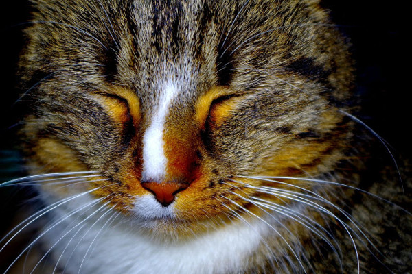

= imgcompare

This little tool compares two images using pillow's ImageChops and then converts the differnce to
black/white and sums up all found differences by summing up the histogram values of the difference
pixels.

Taking the difference between a black and a white image of the same size as base a percentage value
is calculated.

Check the tests to see example diffs for different scenarios. Don't expect the diff of two jpg images be
the same for the same images converted to png. Don't do interformat compares (e.g. JPG with PNG).

**CAUTION: Due to major changes in Pillow 7.0.0 the calculated outputs (percentages, etc.) differ
           to those calculated before.**                                       

== Dependencies

* Pillow ( https://python-pillow.org/ )
   * Stable behavior with Pillow <= 6.2.2
   * Different percentages with Pillow >= 7.0.0

== Usage

=== compare images

    same = is_equal("image_a.jpg", "image_b.jpg")

use the tolerance parameter to allow a certain diff pass as same

    same = is_equal("image_a.jpg", "image_b.jpg", tolerance=2.5)

=== get the diff percentage

    percentage = image_diff_percent("image_a.jpg", "image_b.jpg")

or work directly with pillow image instances (also works for is_equal)

    image_a = Image.open("image_a.jpg")
    image_b = Image.open("image_b.jpg")
    percentage = image_diff_percent(image_a, image_b)
    

== Examples

On Image B the cat wears some fancy goggles (you can see it better when you view
the full pic), which results in a small difference.

=== Slight Difference

*Image A*

image::./tests/testimages/cat.jpg[Cat,150]

*Image B*

image::./tests/testimages/cat_slight_diff.jpg[Cat Slight Diff,150]

    imgcompare.image_diff_percent(JPG_CAT, JPG_CAT_SLIGHT_DIFF)

    result => 0.344547385621

=== Difference between jpg and same jpg encoded again

Image B is Image A, but run again through the JPEG encoder, so Image B now
has slightly more compression artefacts than Image A, which results in a small diff.

*Image A*

image::./tests/testimages/cat.jpg[Cat,150]

*Image B*

    imgcompare.image_diff_percent(JPG_CAT, JPG_CAT_REENCODED)

    result => 0.0149232026144
    
=== Black and White

When comparing a fully black image with a fully white one, the expected
difference is 100%.

*Image A*

*Image B*

image::./tests/testimages/white.jpg[White,150]

    imgcompare.image_diff_percent(JPG_BLACK, JPG_WHITE)

    result => 100.0
    
=== Black and Half-Black-White

Comparing a full black image with a half black, half white one
gives a difference of 50%.

*Image A*

*Image B*

    imgcompare.image_diff_percent(JPG_BLACK, JPG_HALF_BW)

    result => 50.0
    
    
    
== License

MIT License
