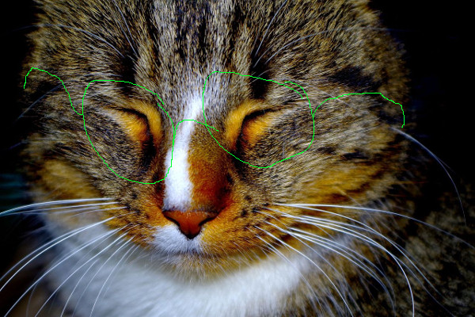

# imagecompare

This little tool compares two images using pillow's ImageChops and then converts the differnce to
black/white and sums up all found differences by summing up the histogram values of the difference
pixels.

Taking the difference between a black and a white image of the same size as base a percentage value
is calculated.

Check the tests to see example diffs for different scenarios. Don't expect the diff of two jpg images be
the same for the same images converted to png. Don't do interformat compares (e.g. JPG with PNG).

## Usage

### compare images

    same = is_equal("image_a.jpg", "image_b.jpg")

use the tolerance parameter to allow a certain diff pass as same

    same = is_equal("image_a.jpg", "image_b.jpg", tolerance=2.5)

### get the diff percentage

    percentage = image_diff_percent("image_a.jpg", "image_b.jpg")

or work directly with pillow image instances (also works for is_equal)

    image_a = Image.open("image_a.jpg")
    image_b = Image.open("image_b.jpg")
    percentage = image_diff_percent(image_a, image_b)
    

## Examples

### Slight Difference

*Image A*

*Image B*

    imagecompare.image_diff_percent(JPG_CAT, JPG_CAT_SLIGHT_DIFF)

    result => 0.344547385621

### Difference between jpg and same jpg encoded again

*Image A*

*Image B*

    imagecompare.image_diff_percent(JPG_CAT, JPG_CAT_REENCODED)

    result => 0.0149232026144
    
### Black and White

*Image A*

*Image B*

    imagecompare.image_diff_percent(JPG_BLACK, JPG_WHITE)

    result => 100.0
    
### Black and Half-Black-White

*Image A*

*Image B*

    imagecompare.image_diff_percent(JPG_BLACK, JPG_HALF_BW)

    result => 50.0
    
## License

MIT License